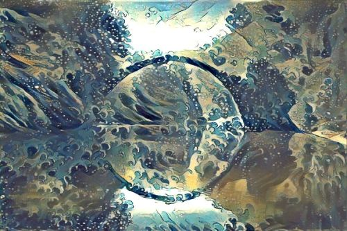
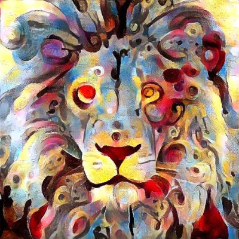
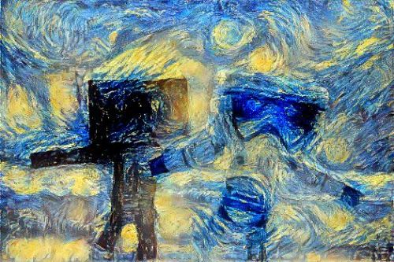
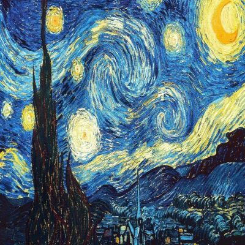

# Neural Style Transfer

This repository contains a simple implementation of neural style transfer using TensorFlow. Neural style transfer is a technique that uses a neural network to apply the style of one image to the content of another image.

### What is NST algorithm?
The algorithm transfers style from one input image (the style image) onto another input image (the content image) using CNN nets (usually VGG-16/19) and gives a composite, stylized image out which keeps the content from the content image but takes the style from the style image.

### Why yet another NST repo?
It's the **cleanest and most concise** NST repo that I know of + it's written in **PyTorch!** :heart:

Most of NST repos were written in TensorFlow (before it even had L-BFGS optimizer) and torch (obsolete framework, used Lua) and are overly complicated often times including multiple functionalities (video, static image, color transfer, etc.) in 1 repo and exposing 100 parameters over command-line (out of which maybe 5 or 6 may actually be used on a regular basis).

## Examples

Transfering style gives beautiful artistic results:

And here are some results coupled with their style:

*Note: all of the stylized images were produced by me (using this repo), credits for original image artists [are given bellow](#acknowledgements).*

# Acknowledgments
This implementation is based on the following papers:

A Neural Algorithm of Artistic Style, Gatys et al. (2015)
Perceptual Losses for Real-Time Style Transfer and Super-Resolution, Johnson et al. (2016)

## Connect with me

If you'd love to have some more AI-related content in your life :nerd_face:, consider:
* Follow me on [LinkedIn](https://www.linkedin.com/in/rohitkumar-ml/)  :bulb:
*  :books: :heart:

## Licence

